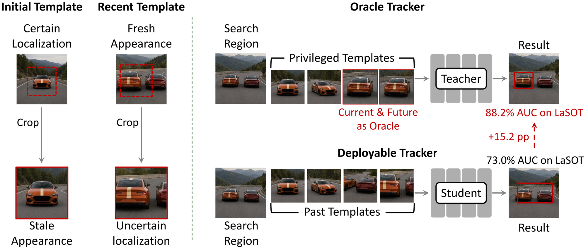
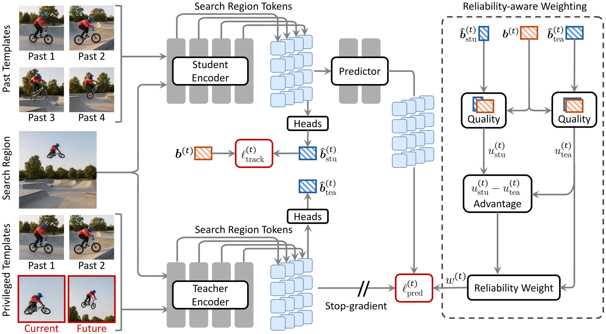

# Learning to Track from Privileged Target Appearances

**Xin Chen, Jiao Xu, Dong Wang, Huchuan Lu, and Kede Ma**

[[Paper](https://arxiv.org/abs/2609.02471)]

## Overview

Target templates define what a visual tracker searches for, but the templates available at inference must trade off localization certainty against appearance freshness. We introduce **Privileged Appearance Transfer for Tracking (PATT)**, a teacher-student framework that uses exact current- and future-frame target crops as privileged supervision during training. After training, the teacher, predictor, reliability weights, and privileged crops are removed, leaving standard student-only inference.

## Motivation

## Framework

## Code

Code will be released soon.
